# Henry Ford — App Mobile

Aplicativo mobile do **Henry**, um assistente de manutenção preventiva para veículos Ford.
Projeto desenvolvido para o Challenge FIAP + Ford, disciplina de Mobile Development and IoT
(Sprint 3).

- Repositório: https://github.com/lorransantosdev/fiap-henry-multimidia-mobile
- Download do APK (Android): https://github.com/lorransantosdev/fiap-henry-multimidia-mobile/releases/tag/v1.0.0

## Sumário

1. [O problema](#o-problema)
2. [A solução](#a-solução)
3. [Funcionalidades](#funcionalidades)
4. [Telas](#telas)
5. [Como instalar e testar](#como-instalar-e-testar)
6. [Roteiro de teste dos fluxos](#roteiro-de-teste-dos-fluxos)
7. [Arquitetura](#arquitetura)
8. [Tecnologias](#tecnologias)
9. [Testes automatizados](#testes-automatizados)
10. [Gerando um novo APK](#gerando-um-novo-apk)
11. [Limitações](#limitações)
12. [Integrantes](#integrantes)

## O problema

Hoje o motorista normalmente só descobre um problema no carro quando ele já aconteceu: uma luz
acende no painel, o carro não liga ou um barulho aparece. Nessa hora ele precisa procurar uma
oficina, explicar o que está sentindo e esperar um diagnóstico.

Isso gera três dores:

- **Manutenção corretiva em vez de preventiva**, que costuma ser mais cara e mais arriscada.
- **Falta de contexto na concessionária**, que recebe o carro sem saber o histórico do problema.
- **Perda de valor do veículo**, quando o dono faz serviços fora da rede oficial e o carro perde
  o histórico de manutenção reconhecido pela Ford.

## A solução

O Henry acompanha a saúde do veículo e avisa o motorista **antes** de o problema virar uma falha.
Quando identifica um sinal fora do padrão, ele:

1. **Avisa de forma proativa**, com uma notificação e uma mensagem falada.
2. **Explica** o que foi identificado, a probabilidade de falha, a prioridade e se é seguro
   continuar dirigindo.
3. **Recomenda** o serviço adequado e o tempo estimado.
4. **Agenda** na concessionária Ford escolhida pelo motorista.
5. **Envia o diagnóstico** para a concessionária, para que o motorista não precise explicar o
   problema.

Além disso, o app mantém o **Selo de Manutenção Oficial**: enquanto a manutenção mais recente foi
feita na rede Ford, o selo fica ativo e agrega valor de revenda ao veículo. Um serviço feito fora
da rede pausa o selo e mostra ao motorista quanto isso impacta no valor do carro. O selo volta a
ficar ativo na próxima manutenção feita na rede oficial.

## Funcionalidades

### Acesso

- Login com validação de e-mail e senha e mensagens de erro claras.
- Sessão salva no aparelho: ao reabrir o app, o usuário continua logado.
- Logout pelo perfil.
- As telas internas só ficam acessíveis depois do login.

### Início

- Health Score do veículo (0 a 100) em destaque.
- Aviso de recomendação pendente, quando existe.
- Atalhos para selo oficial, agendamento, assistente e modo apresentação.
- Próximo agendamento.

### Aviso proativo do Henry

- Notificação dentro do app assim que um evento é detectado.
- Mensagem falada em português (síntese de voz) e vibração.
- Opções "Sim, explicar" e "Agora não".

### Alerta e recomendação

- Sistema afetado, prioridade e probabilidade de falha.
- Explicação em linguagem simples ("O que isso significa?").
- Recomendação, tempo estimado do serviço e orientação sobre continuar dirigindo.
- Motivos para fazer o serviço na rede Ford (selo, valor de revenda, diagnóstico compartilhado).

### Agendamento na rede Ford

Fluxo em três etapas, com indicador de progresso:

1. Escolha da concessionária (distância, avaliação e primeiro horário disponível).
2. Escolha do dia, do horário e observações opcionais.
3. Confirmação, com o resumo do agendamento e a lista de dados enviados à concessionária.

### Gestão de agendamentos

- Lista de agendamentos ativos e histórico.
- Detalhe do agendamento, com botões para ligar para a concessionária e abrir a rota no mapa.
- Reagendar, cancelar, marcar como concluído e excluir do histórico.
- Concluir o serviço recomendado resolve o alerta e registra a manutenção como oficial.

### Veículo e selo de manutenção

- Indicadores por sistema: motor, freios, bateria, pneus e fluidos.
- Evolução do Health Score nos últimos 30 dias.
- Selo de Manutenção Oficial, percentual de serviços feitos na rede e valor de revenda estimado.
- Histórico de manutenção, com cada serviço marcado como rede oficial ou fora da rede.
- Cadastro de nova manutenção, com validação dos campos.

### Assistente Henry

- Conversa por texto com sugestões rápidas.
- Responde sobre saúde do carro, agendamentos, valor de revenda e selo oficial.
- Respostas faladas e atalhos para as telas relacionadas.
- Opção para ligar e desligar a voz.

### Modo apresentação

Ferramenta para demonstrar o app sem depender de dados reais do veículo:

| Cenário             | Health Score | Prioridade |
|---------------------|:------------:|:----------:|
| Freios              | 72           | Média      |
| Bateria             | 61           | Alta       |
| Pneus               | 79           | Média      |
| Saúde normal        | 94           | Nenhuma    |
| Reparo fora da rede | 91           | Nenhuma    |

## Telas

| | | | |
|:-:|:-:|:-:|:-:|
| 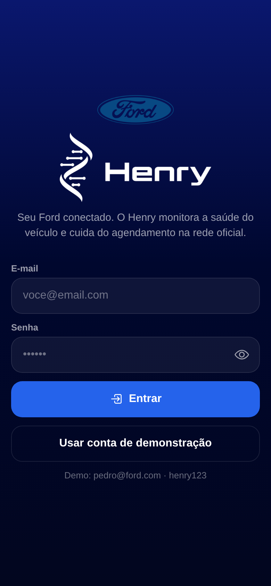 | 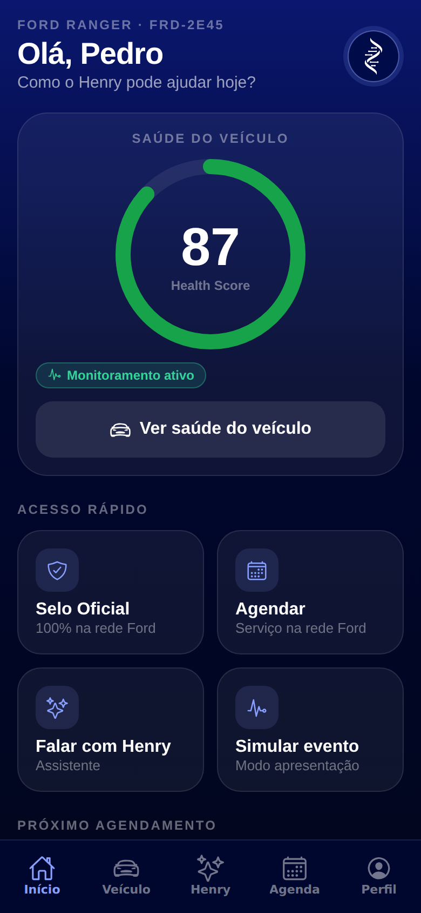 | 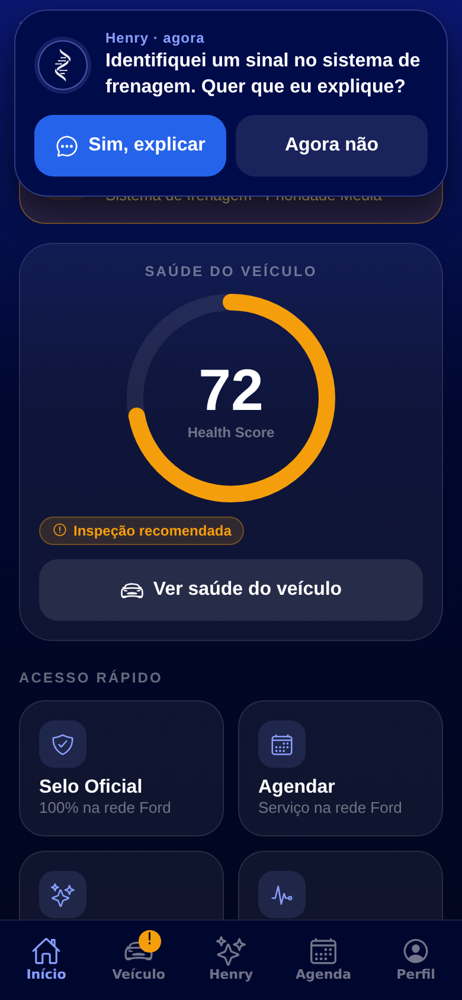 | 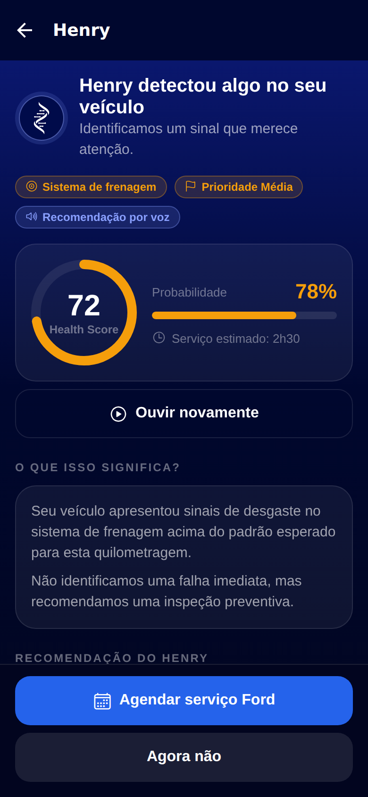 |
| Login | Início | Aviso do Henry | Alerta |
| 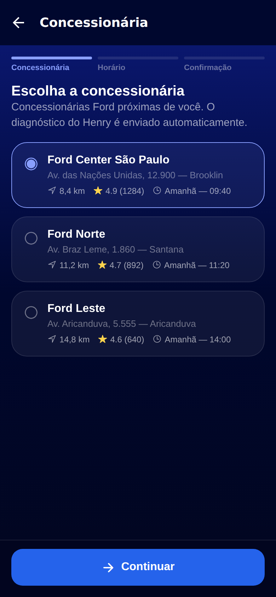 | 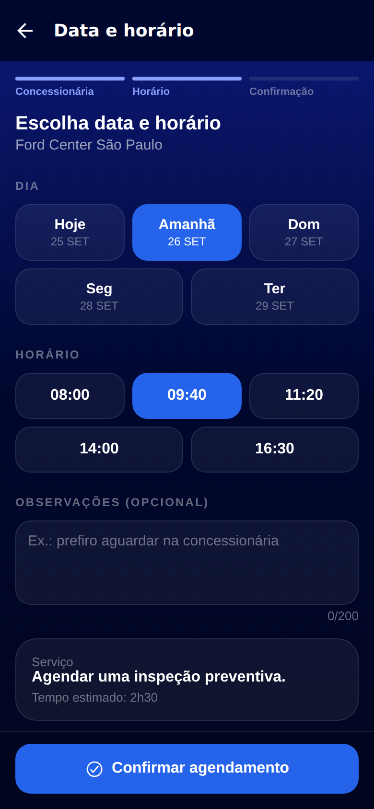 | 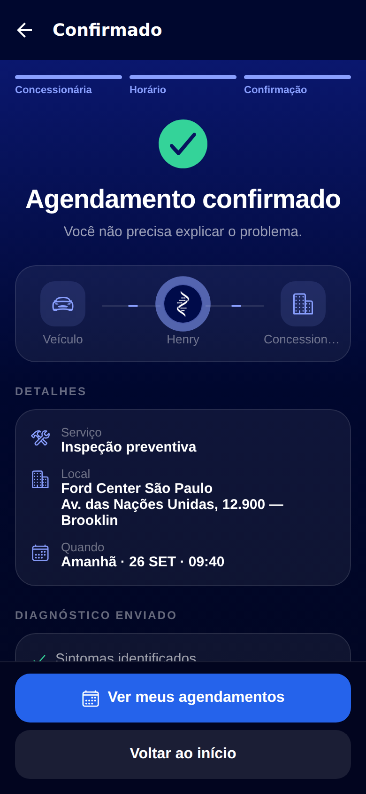 |  |
| Concessionária | Data e horário | Confirmação | Agenda |
| 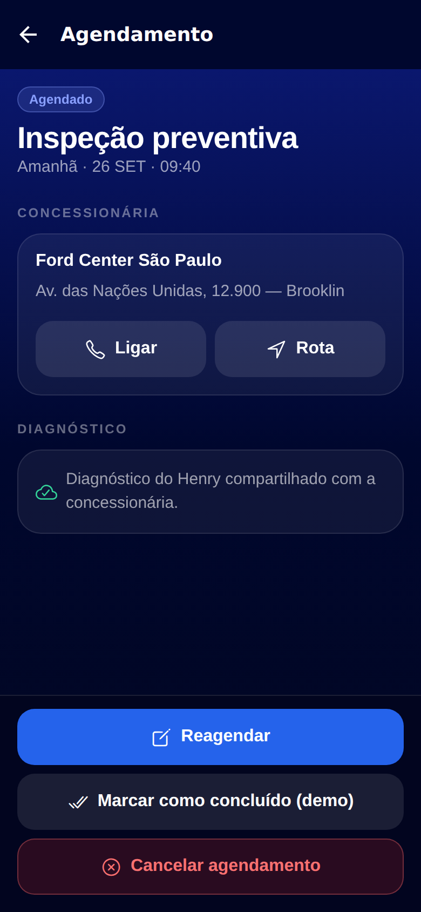 | 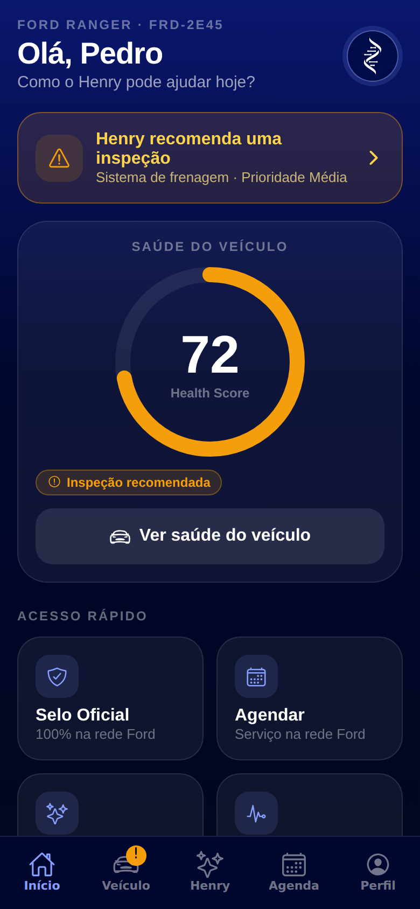 | 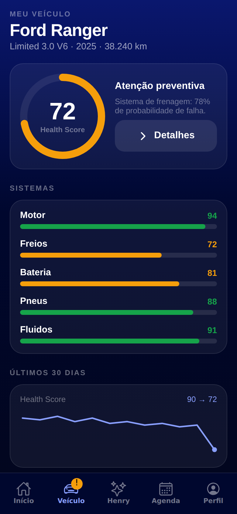 | 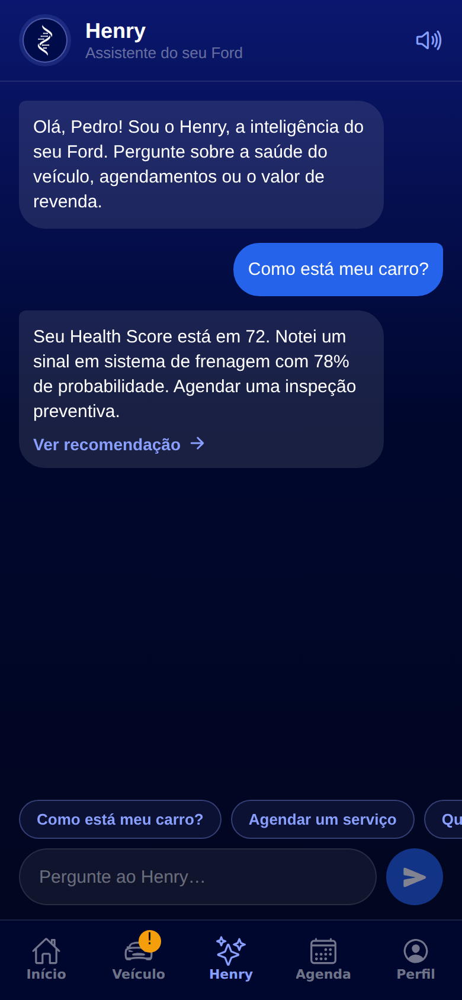 |
| Detalhe do agendamento | Início com alerta | Veículo | Assistente |
| 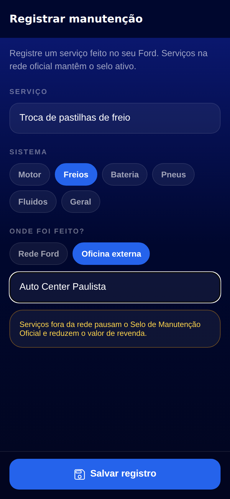 | 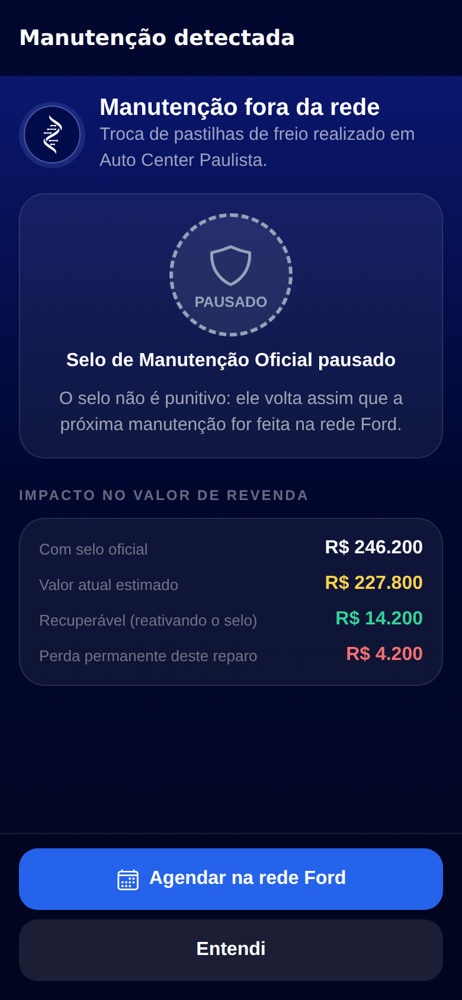 | 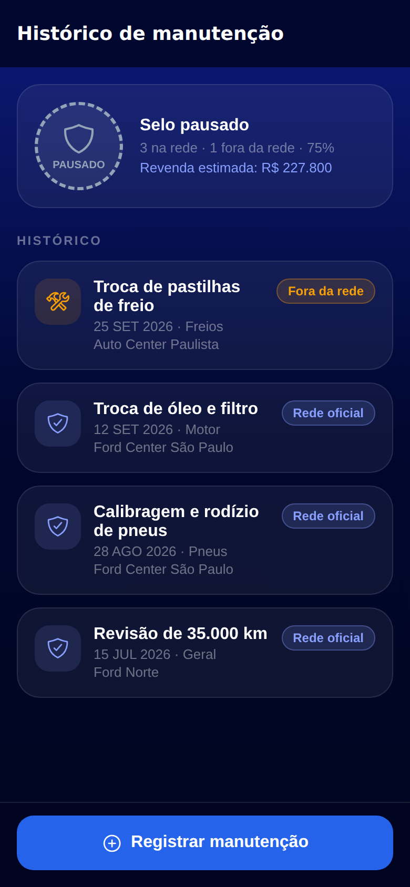 | 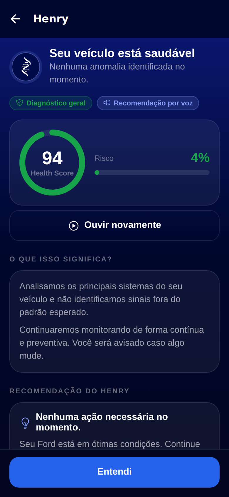 |
| Registrar manutenção | Fora da rede | Histórico e selo | Saúde normal |
| 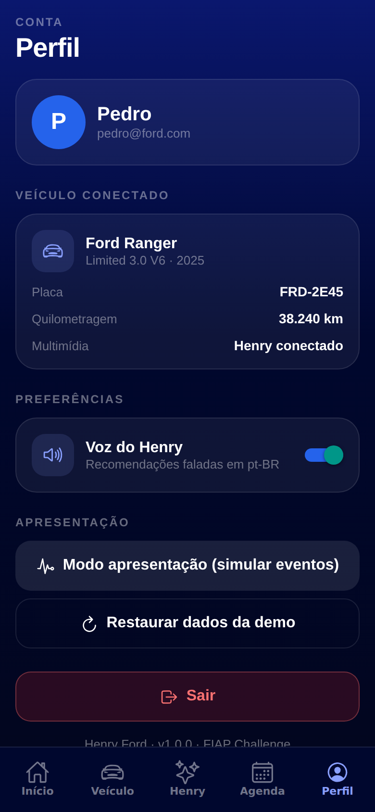 | 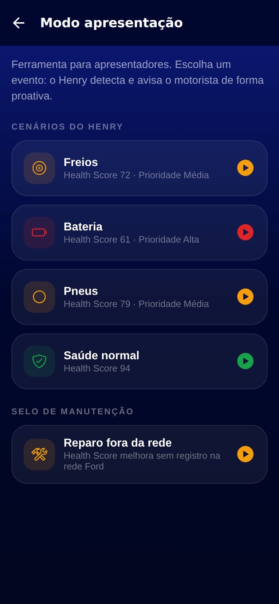 | | |
| Perfil | Modo apresentação | | |

## Como instalar e testar

### Opção 1: instalar o APK (Android)

1. No celular Android, abra a página da release:
   https://github.com/lorransantosdev/fiap-henry-multimidia-mobile/releases/tag/v1.0.0
2. Baixe o arquivo `.apk` da seção "Assets".
3. Abra o arquivo baixado. Se o Android pedir, permita a instalação de apps de fontes
   desconhecidas.
4. Abra o app **Henry Ford**.

Também é possível instalar em um emulador do Android Studio: basta arrastar o `.apk` para a
janela do emulador.

### Opção 2: rodar pelo código com o Expo Go (Android ou iPhone)

Requisitos: Node.js 20 ou superior e o app **Expo Go** instalado no celular.

```bash
git clone https://github.com/lorransantosdev/fiap-henry-multimidia-mobile.git
cd fiap-henry-multimidia-mobile
npm install
npx expo start
```

Escaneie o QR code exibido no terminal com o Expo Go (Android) ou com a câmera (iPhone). O
computador e o celular precisam estar na mesma rede. Se não conectar, use
`npx expo start --tunnel`.

### Login de teste

- E-mail: `pedro@ford.com`
- Senha: `henry123`

Também é possível usar o botão "Usar conta de demonstração" na tela de login.

## Roteiro de teste dos fluxos

1. **Login**: toque em "Entrar" com os campos vazios para ver a validação. Depois entre com a
   conta de teste.
2. **Aviso do Henry**: na tela Início, toque em "Simular evento" e escolha "Bateria". O Henry
   mostra o aviso e fala a mensagem.
3. **Alerta**: toque em "Sim, explicar" para ver prioridade, probabilidade e recomendação.
4. **Agendamento**: toque em "Agendar serviço Ford", escolha a concessionária, o dia e o horário
   e confirme.
5. **Agenda**: toque em "Ver meus agendamentos", abra o agendamento e teste reagendar, cancelar,
   concluir e excluir.
6. **Selo de manutenção**: na aba Veículo, abra "Histórico de manutenção" e registre um serviço em
   "Oficina externa". O selo é pausado e o valor de revenda cai. Registre em seguida um serviço na
   "Rede Ford" para reativar o selo.
7. **Assistente**: na aba Henry, pergunte "Quanto vale meu carro?" ou use as sugestões.
8. **Perfil**: desligue a voz do Henry, restaure os dados da demonstração ou saia da conta.

## Arquitetura

O app foi construído com Expo e React Native, usando o Expo Router para a navegação baseada em
arquivos. O estado global fica em um Context do React e é persistido no aparelho com AsyncStorage.
Não há backend: os dados do veículo e das concessionárias são simulados.

```
src/
├── app/                      Rotas (Expo Router)
│   ├── _layout.tsx           Stack principal e controle de acesso por login
│   ├── login.tsx             Tela de login
│   ├── (tabs)/               Abas: Início, Veículo, Henry, Agenda e Perfil
│   ├── alert.tsx             Alerta e recomendação do Henry
│   ├── demo.tsx              Modo apresentação
│   ├── off-network.tsx       Aviso de manutenção fora da rede
│   ├── schedule/             Agendamento: concessionária, horário e confirmação
│   ├── booking/[id].tsx      Detalhe do agendamento
│   └── maintenance/          Histórico e cadastro de manutenção
├── components/               Componentes visuais reutilizados em todas as telas
├── data/                     Dados simulados: cenários, veículo, concessionárias e manutenção
├── services/                 Login, armazenamento local e síntese de voz
├── store/AppContext.tsx      Estado global da aplicação
└── theme.ts                  Cores, espaçamentos e bordas
__tests__/                    Testes de integração
docs/screenshots/             Capturas das telas
```

### Navegação

- **Stack principal**: controla o acesso. Sem sessão, só a tela de login fica disponível. Com
  sessão, ficam liberadas as abas e as demais telas.
- **Abas inferiores**: Início, Veículo, Henry, Agenda e Perfil.
- **Modais**: alerta, modo apresentação, aviso de manutenção fora da rede e cadastro de
  manutenção.
- **Rota dinâmica**: `booking/[id]` para o detalhe de cada agendamento.

### Estado e persistência

O `AppContext` concentra a sessão, o cenário atual do Henry, os agendamentos, o histórico de
manutenção e as preferências. Cada parte é salva no AsyncStorage sempre que muda e carregada
quando o app abre. O valor de revenda e a situação do selo são calculados a partir do histórico
de manutenção.

### Identidade visual

Todas as telas usam os mesmos componentes (`Button`, `Card`, `Pill`, `Screen`, entre outros) e os
mesmos tokens de cor e espaçamento definidos em `theme.ts`. A paleta segue as cores da Ford (azul
marinho e azul) com cores de status para saúde boa, atenção e crítico.

## Tecnologias

| Tecnologia | Uso |
|---|---|
| Expo SDK 57 | Base do projeto e build do APK |
| React Native 0.86 e React 19 | Interface |
| TypeScript | Tipagem |
| Expo Router | Navegação por arquivos, abas, modais e rotas protegidas |
| AsyncStorage | Persistência local |
| expo-speech | Voz do Henry em português |
| expo-haptics | Vibração nos toques e avisos |
| react-native-svg | Gráfico de evolução e anel do Health Score |
| expo-linear-gradient | Fundo das telas |
| EAS Build | Geração do APK |
| Jest e React Native Testing Library | Testes automatizados |

## Testes automatizados

```bash
npm test
```

São 21 testes de integração que renderizam as telas reais e navegam entre elas como o usuário
faria. Eles cobrem:

- Login: campos obrigatórios, e-mail inválido, senha incorreta, login, sessão salva e logout.
- Fluxo do Henry: aviso com voz, alerta e agendamento completo.
- Agendamentos: criação, reagendamento, cancelamento, exclusão e conclusão.
- Selo de manutenção: pausa com serviço fora da rede, reativação com serviço oficial e valor de
  revenda.
- Navegação pelas abas, cenário de saúde normal e assistente.

Outros comandos:

```bash
npm run lint        # análise estática
npm run typecheck   # verificação de tipos
```

## Gerando um novo APK

O APK é gerado na nuvem pelo EAS Build, sem precisar do Android Studio.

```bash
npx eas-cli@latest login
npx eas-cli@latest build -p android --profile preview
```

Ao final, o EAS mostra um link para baixar o `.apk`. O perfil `preview` do `eas.json` gera o
`.apk` para instalação direta. O perfil `production` gera o `.aab` usado na Play Store.

## Limitações

- Não há integração real com o veículo. Os eventos são simulados pelo modo apresentação.
- O login e os dados das concessionárias são simulados, sem backend.
- Os dados ficam salvos apenas no aparelho.
- O APK é para Android. No iPhone o app pode ser testado pelo Expo Go.

## Integrantes

| Nome | RM |
|---|---|
| Fabiano | 555524 |
| Lorran | 558982 |
| Maria | 557478 |
| Pedro | 556268 |
| Vinícius | 555200 |
